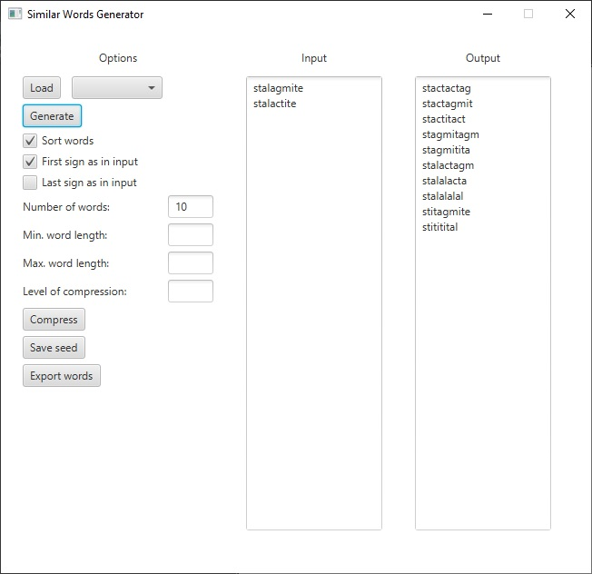

# Similar Words Generator desktop application

It is a program to generate words similar to given input.

## Description

A project of desktop application for generating words. It bases on library io.github.wsz82:similar-words-generator:1.0 added to Central Repository. Memento pattern is to restore settings after closing the application.

## Installation

The project uses Java SDK 12 and JavaFX SDK 12. Follow instructions on https://openjfx.io/openjfx-docs/ to add JavaFX to the project.  

## Usage

A window application is made to operate the model. Class Controller is responsible for communication between model and application. The program is released at https://www.nexusmods.com/morrowind/mods/47050

## Contributing
Pull requests are welcome. For major changes, please open an issue first to discuss what you would like to change.

Please make sure to update tests as appropriate.

## License
[MIT](https://choosealicense.com/licenses/mit/)